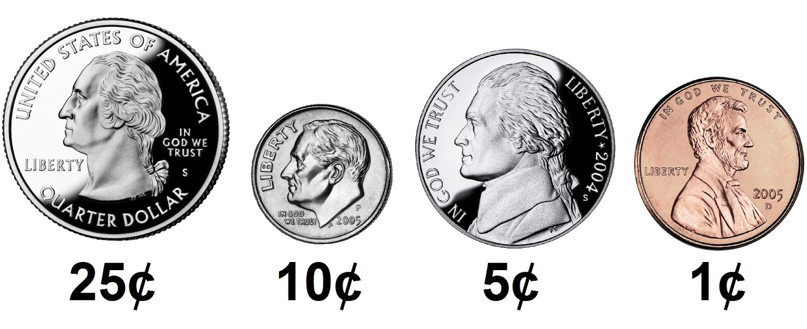

# cash-1.c

When dispensing change for customers, you would want to minimize the number of coins being dispensed. Using greedy algorithm, I solved the minimum number of coins that is due upon dispensing. 

### What is a greedy algorithm? 

According to the National Institute of Standards and Technology (NIST), a greedy algorithm is one “that always takes the best immediate, or local, solution while finding an answer. Greedy algorithms find the overall, or globally, optimal solution for some optimization problems, but may find less-than-optimal solutions for some instances of other problems.”

### How is greedy algorithm usefull for coin dispensing?

Say we have a customer owed $1.10 in change. We could give 110 pennies, or 11 dimes, or even 22 nickels. With greedy algorithm or largest-to-smallest approach, we can get the fewest number of coins possible. We start with quarters, then move to dimes, nickels, and pennies. In our case, we can use 4 quarters to add up to $1 and 1 dime to equal #1.10. Hence, we would have 5 coins as the overall optimal solution to this problem of finding the minimum number of coins dispensed as the change. 

Program should behave as below examples:

```
$ ./cash-1
Change owed: 0.41
4
```

```
$ ./cash-1
Change owed: 1.10
5
```

***

# How to run the programs?

1. Compile by running make or clang or gcc in terminal
2. Run the program by running ./cash-1


# Word of caution when compiling

You must install CS50 library for C in order to compile. Installation guide is [here](https://cs50.readthedocs.io/library/c/). 